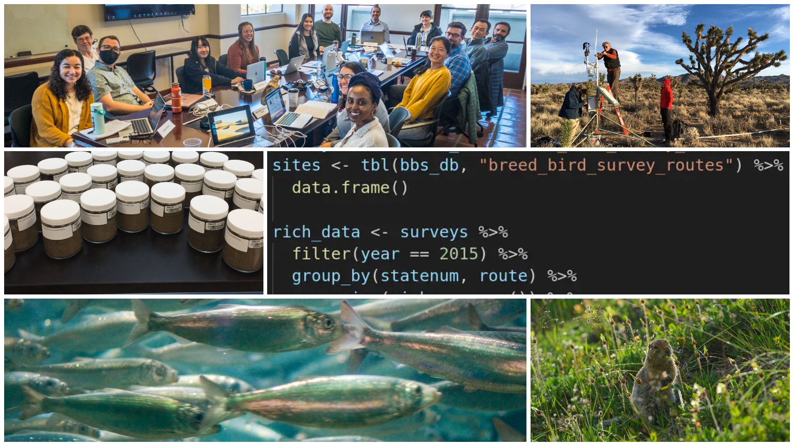
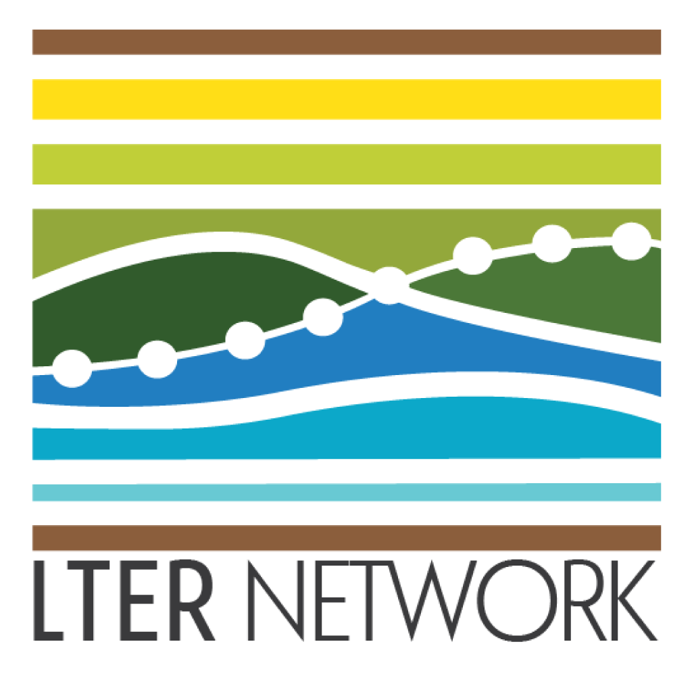
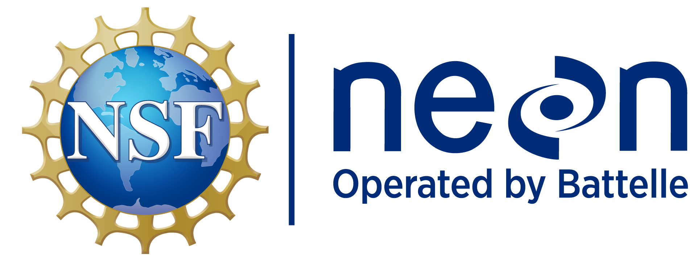

<p align="center">



</p>

## Abstract

In recent decades, ecology has become a more collaborative discipline motivated by the search for generality across ecosystems. At the same time,the availability, quantity, and quality of environmental data have grown rapidly, creating opportunities for re-use of these data in ecological synthesis research. Though synthesis research is complex and demanding, taking an inclusive and collaborative approach to both the scientific process and the data pays dividends throughout the lifetime of a project. In 2026, we are offering a workshop, focusing on refining a synthesis-relevant question, building and stewarding a team of collaborators, and identifying the applicable data.

The full short course which we offered in 2025, is a survey of methods for making ecological synthesis research a "team sport", and all the materials remain available on this website.

Objectives for learners are to

```         
a.  gain team science and project management skills that are needed for synthesis and that are immediately useful in a research team setting,
b. locate and become familiar with resources to gain the data science skills needed for reproducible synthesis
c.  focus on developing their own synthesis projects, whatever stage they are in, through interaction with instructors and peers.
```

Instructors will cover an overview of the synthesis process, assembling the team, identifying and refining the question(s), collecting primary data sources, and project management. The course uses real-world examples, demonstrations, and interactive lessons in small groups. Ecologists with synthesis experience will be on hand with seasoned research advice and data tips.

## Agenda for 2026-07-27

This agenda is subject to change!

| Timing (PT) |             Content             |
|:-----------:|:-------------------------------:|
|   1:30 pm   |     Welcome & Introductions     |
|   1:40 pm   | Synthesis Process and Resources |
|   1:50 pm   |  What makes a "good" question   |
|   2:10 pm   | Building and stewarding a team  |
|   2:30 pm   |          Locating data          |
|   2:50 pm   |             Wrap-up             |

## Shared notes document

A [**communal notes document**](https://docs.google.com/document/d/1RC7tXnGvxRCd2xqjYowOmDKkiCU_VN51ldOOGyL3dTc/edit?usp=sharing) will be used during some of the discussions we'll have, and are a good place to drop on-the-fly feedback about the course. Keep the link handy and we'll ask for your input to these notes at key times.

## Introductions & Icebreaker

Before we begin, we'd love to get a sense for who you all are and why you're interested in synthesis work! To that end, we'll take a few minutes and go around the room for introductions. Please include:

- Your name and pronouns
- A 1-sentence summary of your work
- Briefly, <u>why are you interested in synthesis</u>?

## Code of Conduct

[ESA Code of Conduct](https://esa.org/baltimore2025/code-of-conduct/?_gl=1*152l98t*_ga*MTM1ODE1ODg1Mi4xNzM0NDYyNDc4*_ga_GXP5K1BM5L*czE3NTQ1MDQxMjMkbzkkZzAkdDE3NTQ1MDQxMjMkajYwJGwwJGgw)

Briefly: Treat all participants with kindness, respect, and consideration, valuing a diversity of views and opinions. Report unacceptable behavior at (844)-641-4133 or email codeofconduct\@esa.org

## Note on Course Materials

This short course is being offered for the second time at [ESA 2025](https://esa.org/baltimore2025/), and we've chosen to assemble these materials as a living website so that we can revisit and improve the materials over time. So, **we recommend that you save the link to this site** so that you can have easy access to these materials now and as they are refined going forward. Also, much of the content is covered more completely in our year-long synthesis course: [Synthesis Skills for Early Career Researchers (SSECR)](https://lter.github.io/ssecr/).

If you are a  GitHub aficionado, we have deployed this website via GitHub Pages so you could also "star" the website's repository. Simply click the  GitHub octocat logo on the right side of the navbar (at the top of the screen) to be redirected to the GitHub repository underpinning this website.

Finally, we have developed all of this website using [Quarto](https://quarto.org/).

## Credits

The course and its content were developed by a large team. See the [**People page**](people.qmd) to learn more.

**Supported by:**

::: {#credit-orgs layout-ncol="3"}
[{width="1.2in"}](https://edirepository.org)

[{width="1.2in"}](https://lternet.edu)

[](https://neonscience.org)
:::

**Collage photo credits:** Jacob Bøtter via Flickr, CC BY-SA 2.0 \| Jeremy Yoder via Flickr, CC BY-SA 2.0 \| Marco Pfeiffer, CC BY-SA 4.0 \| Gabriel De La Rosa, CC BY-SA 4.0 \| Weecology lab CC BY 4.0 \| NEON (National Ecological Observatory Network)
