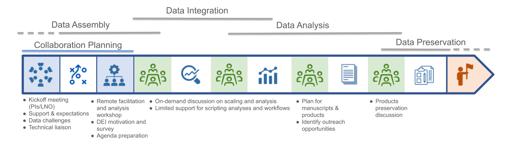
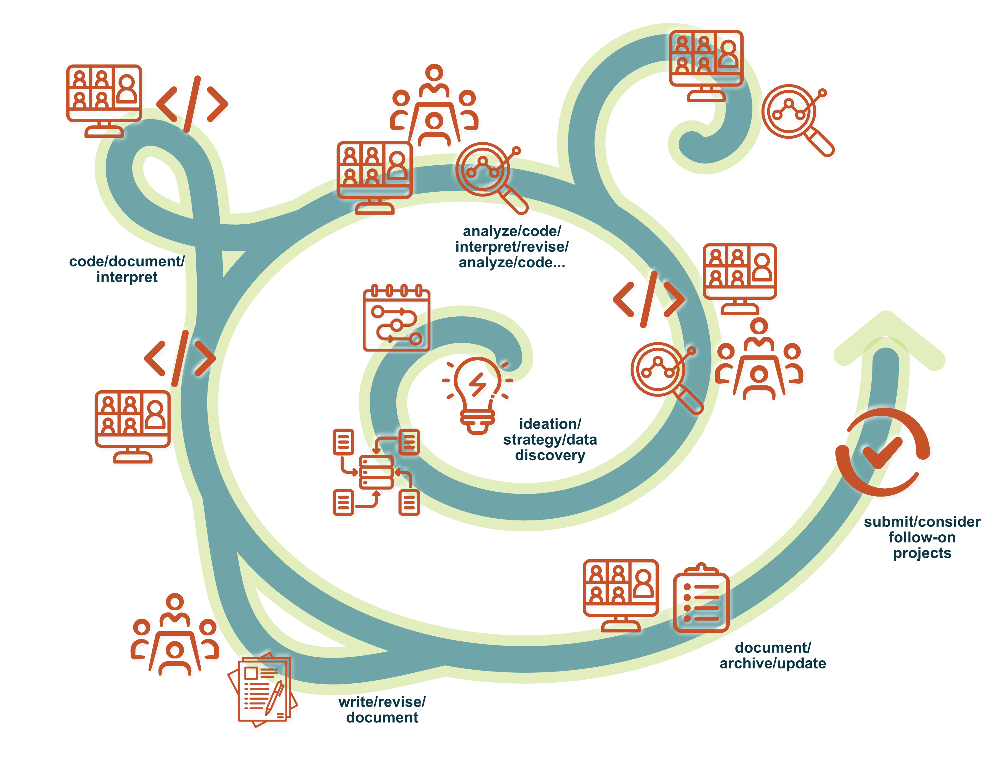
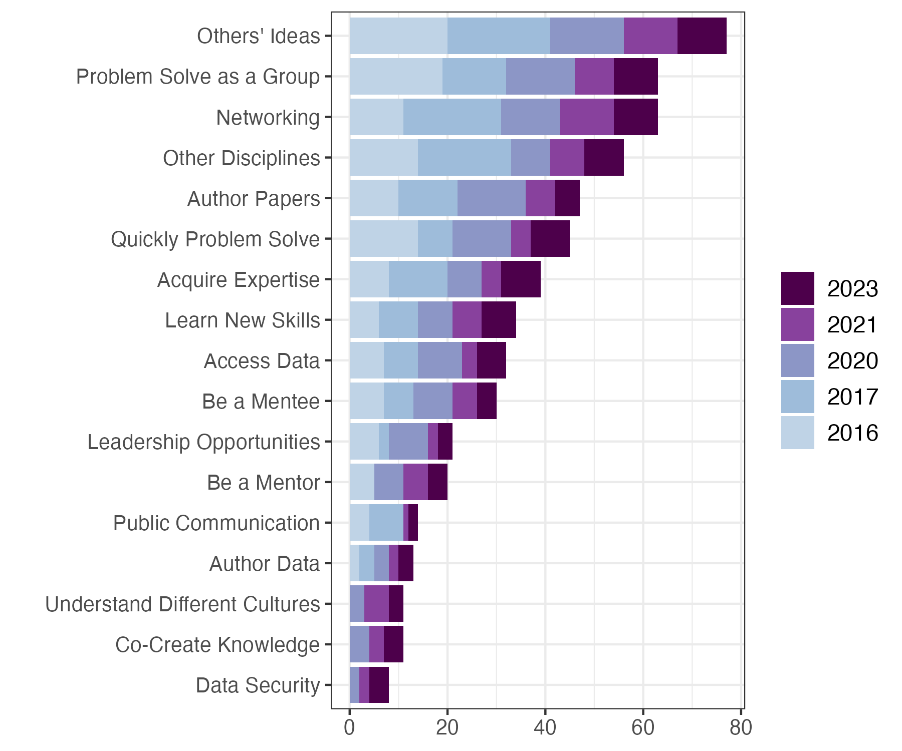
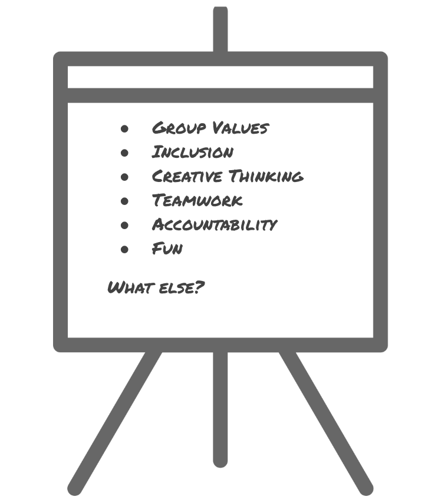
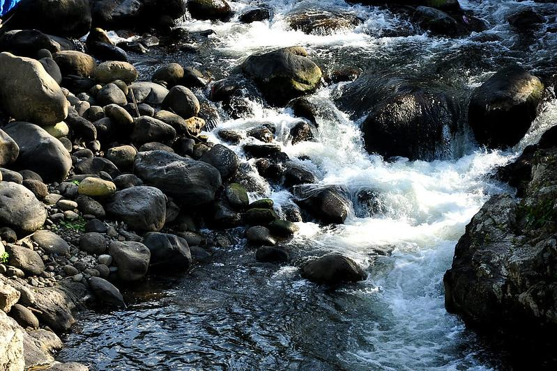
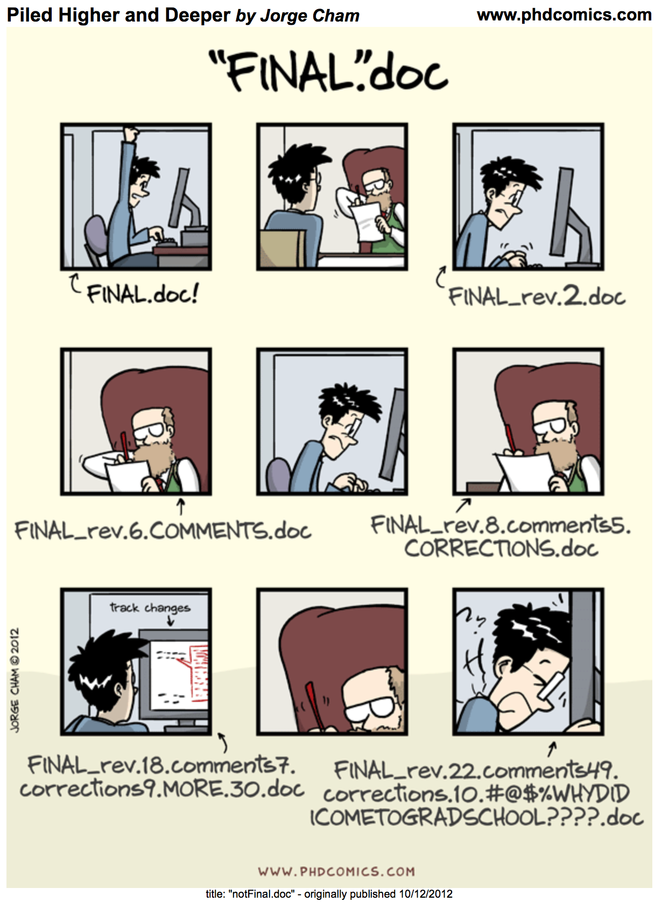

## Abstract

The plethora of open data that is now available creates opportunities for important and innovative science through data synthesis. Synthesis science combines data from multiple studies to draw conclusions about broader ecological theory and mechanisms or to extend the range of inference. It often results in higher-impact publications and generates science that is especially valuable in practice and policy. When done well, it’s also really fun! In this workshop, we’ll explore the interactive process of developing a synthesis project idea and building a team that can see it through. In the first portion of the workshop, we’ll cover common team synthesis models and funding sources, as well as the skills that are essential for gathering a team, keeping them on-track, and facilitating generative discussion. In the second half of the workshop, we’ll break into small groups, facilitated by experienced synthesizers, to explore your synthesis ideas and help you develop plans to move them forward. 

Objectives for learners are to

1. gain team science and project management skills that are needed for synthesis and that are immediately useful in a research team setting,
2. locate and become familiar with resources to gain the data science skills needed for reproducible synthesis
3. focus on developing their own synthesis projects, whatever stage they are in, through interaction with instructors and peers.

## Code of Conduct

[ESA Code of Conduct](https://esa.org/baltimore2025/code-of-conduct/?_gl=1*152l98t*_ga*MTM1ODE1ODg1Mi4xNzM0NDYyNDc4*_ga_GXP5K1BM5L*czE3NTQ1MDQxMjMkbzkkZzAkdDE3NTQ1MDQxMjMkajYwJGwwJGgw)

Briefly: Treat all participants with kindness, respect, and consideration, valuing a diversity of views and opinions. Report unacceptable behavior at (844)-641-4133 or email codeofconduct\@esa.org

## Agenda for 2026-07-27

This agenda is subject to change!

| Timing (PT) |             Content             |
|:-----------:|:-------------------------------:|
|   1:30 pm   |     Welcome & Introductions     |
|   1:40 pm   | Synthesis Process and Resources |
|   1:50 pm   |  What makes a "good" question   |
|   2:10 pm   | Building and stewarding a team  |
|   2:20 pm   |  Locating and managing data    |
|   2:30 pm   |          Discussion            |

## Shared notes document

A [**communal notes document**](https://docs.google.com/document/d/1RC7tXnGvxRCd2xqjYowOmDKkiCU_VN51ldOOGyL3dTc/edit?usp=sharing) will be used during some of the discussions we'll have, and is a good place to drop on-the-fly feedback about the course. Keep the link handy and we'll ask for your input to these notes at key times.

## Introductions

Before we begin, we'd love to get a sense for who you all are and why you're interested in synthesis work! Please briefly introduce yourself at your tables:

- Your name and pronouns
- A 1-sentence summary of your work
- Briefly, <u>why are you interested in synthesis</u>?

Decide on a name for your table-group and add a tab to the notes document with that name.

## Note on Course Materials

This workshop is an adaptation of a full short course that was offered in 2024 and 2025. Materials from those courses are available on the LTER-owned "[eco-data-synth-primer](https://lter.github.io/eco-data-synth-primer/)" GitHub repository, which also links to the materials for this workshop. So, **we recommend that you save the link to this site** so that you can have easy access to these materials now and as they are refined going forward. Also, much of the content is covered more completely in our semester-long synthesis course: [Synthesis Skills for Early Career Researchers (SSECR)](https://lter.github.io/ssecr/).

If you are a  GitHub aficionado, we have deployed this website via GitHub Pages so you could also "star" the website's repository. Simply click the  GitHub octocat logo on the right side of the navbar (at the top of the screen) to be redirected to the GitHub repository underpinning this website.

## What Do We Mean by Synthesis?

::: pull-quote
**Synthesis**: Bringing together data from many sources to generate new scientific insights or test new hypotheses.
:::

Today, we'll focus on the particular flavor of synthesis that involves a team of people.

## Process Overview

Typically, a group of researchers--or researchers and managers or community members--will plan a series of meetings over 2-3 years. The mix of in-person v. virtual meetings and work will vary across different groups and different funders, but the general pattern is similar.

{fig-alt="Graphic depicting a linear progression from idea development and team formation through a series of meetings focused on data discovery, analysis and products." fig-align="center"}

That all seems straightforward enough, but the way it really works is a little more...dynamic. Projects spin off into new territory, promising leads turn out to be dead-ends, key people get new jobs and have to leave the group. Much of what we'll discuss today will help future-proof your process in the event of changing priorities and changing membership.

{fig-alt="Spiral graphic with detours, dead ends, and spinoff projects." fig-align="center" width="2000"}

From: Ten simple rules for ecological synthesis research (2026) Methods in Ecology and Evolution, *in press*

## Why Synthesize?

- Higher impact products
- Incorporating (and learning) new skills
- Building your science community
- Leveraging the effort of the science community by re-using data
- Inclusion — a way to involve less research-intensive institutions and individuals who can't/don't want to do fieldwork

| Academic | Application |
|:-----------------------------------:|:---------------------------------:|
|  |  |
| What benefits were most important to NCEAS working group participants? | Motivations for synthesis [Hackett, E.J. (2020).](https://doi.org/10.3390/su12229361) Sustainability, reproduced from [Reid et al. (2009)](https://doi.org/10.1073/pnas.0900313106) PNAS |

### Funding and Resources

**What do you need to "do" synthesis?**

-  A way to get people together. Unless you decide to work only with people you already know, it's *really* helpful to have at least one in-person meeting where you wrestle with objectives and approaches.
-  Facilitation skills. Many places to acquire these, but also consider hiring a pro the first time around.
-  Project management skills. Maintaining the interest of volunteer researchers means making very efficient use of their time.
-  Data: your own and others'. The most impactful syntheses access a wide variety of data sources that haven't been previously combined.
-  Harmonizing diverse data requires a bit of analytical muscle (your own or others')

**Sources of Support for Synthesis**

::: {.panel-tabset}

#### Discussion

> **What organizations do you know that fund synthesis work?**

::: {.p style="margin-bottom: 2em;"}
:::

#### Synthesis Centers

- [NCEAS](https://www.nceas.ucsb.edu/calls-for-proposals)
  - [Morpho Program](https://www.nceas.ucsb.edu/morpho)
  - [Luna Program](https://www.nceas.ucsb.edu/luna)
- [ESIIL](https://esiil.org/)
- [LTER](https://lternet.edu/stories/rfp-2026/)
- [USGS Powell Center](https://www.usgs.gov/centers/john-wesley-powell-center-for-analysis-and-synthesis/proposal-process)
- [S-div](https://www.idiv.de/en/sdiv.html)
- [Canadian Institute of Ecology and Evolution (CIEE)](https://www.ciee-icee.ca/)

#### Societies

- [New Phytologist Workshops](https://www.newphytologist.org/workshops)
- [Gordon Research Conferences](https://www.grc.org/about/proposing-a-new-gordon-conference/)
- Chapman Conferences
- [British Ecological Society](https://www.britishecologicalsociety.org/funding/synthesis-grants/) (one-third of participants from the developing world)

#### NSF Programs

- [ULTRA-Data DCL](https://www.nsf.gov/pubs/2024/nsf24081/nsf24081.jsp)
- Core programs, e.g., [DEB](https://new.nsf.gov/funding/opportunities/division-environmental-biology-deb), IOS, MCB, Emerging Frontiers, OCE, OPP, RISE
  - Search solicitations for "synthesis activities," "synthesis projects"
- NSF workshops

#### Resources by Funder

| Funder | Travel | PI salary & direct project support | Direct analytical support | Postdoc funding | Facilitation & communication support |
|:----------:|:----------:|:----------:|:----------:|:----------:|:----------:|
| NSF | ✓ | ✓ |  | ✓ |  |
| ESIIL | ✓ |  | ✓ | ✓ |  |
| LTER | ✓ |  | ✓ |  |  |
| NCEAS/Morpho/Luna | ✓ |  |  |  | ✓ |
| Powell Center | ✓ |  |  | ✓ |  |

Everyone offers travel support, but different programs offer different kinds of additional support — remember to budget for the kinds of support that are allowed.

:::

::: {.p style="margin-bottom: 2em;"}
:::

## Identifying a Synthesis-Ready Question

Lots of questions are interesting, but not terribly well-suited for a synthesis approach. We've learned through experience that there are a few qualities that make some questions a better fit for a) combining data; and b) work by a group. The main qualities that we seek in synthesis projects include:

- Novel and interesting enough to spend 2–3 years deeply involved
- Ripe for synthesis
  - Data already exist
  - Large geographic area or temporal extent
  - Data that aren't normally collected/analyzed together
- Clearly framed, but flexible
- Results could include several kinds of products: papers of various kinds, symposia, datasets, analytical packages
- Responsive to the funding call!

::: {.callout-tip collapse="false"}

### Be adaptable!

Keep in mind that early synthesis activities like data discovery and harmonization do not always go to plan. Successful synthesis sometimes requires reframing the research questions or approach as the project proceeds. 

For example, if data prove difficult to find or analyze, the group could consider shifting to higher-level research questions and writing papers that:

* update or propose new conceptual models and provide supporting case-studies.
* serve as a "call to action" regarding new research opportunities or gaps in a field's observational power.

:::

### Examples of Recent Synthesis Groups
|   |   |
|:-:|:---|
|{alt="micrograph of diatoms" width="300"}|[**Controls on River Silica Exports**](https://lternet.edu/working-groups/from-poles-to-tropics-a-multi-biome-synthesis-investigating-the-controls-on-river-si-exports/) (*Combined data from more than 1000 watersheds on 6 continents.*): Climate, Hydrology, and Nutrients Control the Seasonality of Si Concentrations in Rivers. JGR Biosciences 2024|
|{alt="wildland fire silouatting a tree" width="300"}|[**Fire and Aridland Streams**](https://lternet.edu/working-groups/fire-and-aridland-streams/): Persistent and lagged effects of fire on stream solutes linked to intermittent precipitation in arid lands. Biogeochemistry 2024|
| {alt="barley sprouts growing on deep organic soil" width="300"} | [**Soil organic matter: multi-scale observations, manipulations & models**](https://lternet.edu/working-groups/advancing-soil-organic-matter-research/): **Dataset: SoDaH: the SOils DAta Harmonization database, an open-source synthesis of soil data from research networks, version 1.0., EDI 2020**|
|{alt="dried, cracked soil crust" width="300"}|[**Global Synthesis of Multi-year Drought Effects**](https://lternet.edu/working-groups/a-global-synthesis-of-multi-year-drought-effects-on-terrestrial-ecosystems/) (*Integrated 100 grassland and shrubland sites across 6 continents*): Extreme drought impacts have been underestimated in grasslands and shrublands globally. PNAS 2024.|

: {tbl-colwidths="[25,55]" .striped .hover}

::: {.callout-note collapse="false"}

#### Discussion

Open our [**communal notes document**](https://docs.google.com/document/d/1RC7tXnGvxRCd2xqjYowOmDKkiCU_VN51ldOOGyL3dTc/edit?usp=sharing), head to your tab and take a few minutes to jot down your own notes, then discuss.

- What ideas do you have for synthetic studies?
- What factors make them synthesis-ready?
- How could they be adapted if needed (narrower or broader scope, alternative products)?

:::

::: {.callout-tip collapse="true"}

#### Getting Involved in Synthesis

Often, early career researchers will be excited about the idea of synthesis but be unsure how to connect with existing or nascent synthesis efforts. Here are a few ideas for how to make yourself available and valuable to synthesis groups.:

-   Make it known you want to be involved in synthesis
    -   Let your advisor know
    -   Share your enthusiasm
-   Skill building:
    -   [Synthesis Skills for Early Career Researchers: SSECR](https://lter.github.io/ssecr/)
    -   [Data Carpentries](https://carpentries.org/)
    -   ESIIL: innovation summit, hackathons
-   Build your community
    -   Ask questions at meetings
    -   Initiate conversations
-   *Start your own!*
:::

## Building a Team

{padding="20px" style="float: right" width="40%" alt="The Spanish world cup soccer champs 2026"}
Research from organizational development (Horowitz and Horowitz 2007, Agrawal and Wooley, 2018) and the science of team science (Cheruvelil et al. 2014) finds that teams combining members form multiple fields, identities, backgrounds, and functional styles are more creative and produce better results. 

**Diverse Teams Yield:**

-  More creative and innovative approaches
-  Avoiding ‘groupthink’
-  Better cognitive elaboration; more complex thinking
-  Checked assumptions
-  Diversity broadens group scanning ability and consideration of alternative solutions
-  Diverse groups achieve better task completion and more efficient use of resources
-  Solutions generated by diverse groups have more legitimacy and salience

::: {.panel-tabset .nav-pills}

#### **Discussion Question**

> What are some types of difference you might seek out among group leaders and members?

#### **The Leadership Team**

The composition of the leadership team will affect the success of the project and who you will be able to recruit to the larger group. Look for:

-  Different (and complementary) areas of expertise (ecologists, hydrologists, computer scientists, developmental biologists, engineers, etc.)
-  Research approach (modelers, empiricists, humanists, community-engaged researchers)
-  Complementary professional networks
-  Facilitation and project management skills
-  Emotional Intelligence
-  Study system

#### **The Working Group**

In our experience at NCEAS and the LTER Network Office, we've found teams of up to 10 to 15 people to be optimal for synthesis work. As individuals, we all have strengths and weaknesses. The beauty of working in teams is that you can invite people who offset your own weaknesses and who bring strengths you don't have. Often, you'll have a few core team members who have generated a synthesis idea, but then you'll want to take a clear-eyed look at what additional skills and qualities to invite. When you do so, be sure to consider:

-   Skills, Aptitudes, and Communication Styles
    -   Look for a mix of empiricists, theorists, and modellers
    -   Big-picture thinkers, organizers, task-oriented do-ers
    -   Deep thinkers and risk-takers
    -   At least some skilled coders
-   Career stage
    -   Senior investigators connect the team to existing literature and fields of study, connect to a broad network of experienced researchers, and have good knowledge of resources, but often have a very limited amount of time to devote to discussion and analyses.
    -   Junior team members often bring a fresh perspective, familiarity with newer literature, strong coding skills, and time to devote to the project.
-   Emotional intelligence
    -   Research shows (Aggarwal and Woolley, 2018) that the bump in creativity seen in mixed-gender teams is typically due to an increase in emotional intelligence and attention to team dynamics. Include at least a few people with a process orientation and strong people skills.
-   Power dynamics
    -   You won't be able to anticipate all of the issues related to power dynamics that can arise, but keep them front of mind as you assemble a team.
-   Remember that participation in synthesis represents a significant career opportunity.
    -   Be mindful that such career-building opportunities have not been fairly distributed.
    -   Be intentional about seeking out people who may not be part of your typical circles
    
:::

### No Diversity Bonus without Trust

{margin="15px" style="float: right" width="300" alt-text="easel and flipchart with a list of group norms: group values, inclusion, creative thinking, teamwork, accountability, fun"}Diverse teams only get those positive results when the team adopts a **learning mindset** and **the collaboration process allows each participant to contribute in the way that works for them** (van Knippenberg and Hoever 2017), which requires trust, communication, and coordination.

- **Get to know each other.** Spend time early to talk through various perspectives on the question that may be present in the group
- Establish **group norms** collaboratively
- Articulate your **coordination practices** (Where will you keep data? How will you communicate? How often will you meet? What's your authorship model? Do these work for slow and fast processors? Introverts and extroverts?)
- Pay attention to **speaking time**
- Ask the "dumb" questions, they often surface unexamined assumptions
- Spend social time together — meals, activities

::: {layout-ncol="3"}

:::

## Data Sources

One of the most frequent stumbling blocks that we have seen groups encounter is finding that data they thought existed, doesn't. Identifying -- and closely examining -- data sources early can help you avoid this pitfall. 
Some sources of data--such as modern remote sensing products, NEON data, and census data--have very clear, explicit ways to access and download them or work with them in the cloud. But the most interesting synthesis questions often involve combining such "big" data with other data sources that may have been collected manually, by a variety of methods and different technicians, over decades.

::: panel-tabset

#### **Discussion Question**

> **What kinds of data sources might you consider including in a synthesis project, in addition to your own or others' field data?**

#### **A Few Ideas**

-   [DataONE](https://www.dataone.org/)
-   [Environmental Data Initiative](https://edirepository.org/) (EDI)
-   [GenBank (NCBI)](https://www.ncbi.nlm.nih.gov/nuccore/)
-   [National Ecological Observatory Network](https://www.neonscience.org/data) (NEON)
-   [US Geological Survey Data](https://www.usgs.gov/products/data)
-   [Global Biodiversity Information Facility](https://www.gbif.org/) (GBIF)
-   [NASA Remote Sensing Data](https://data.nasa.gov/)
-   [US Park Service](https://www.nps.gov/subjects/science/science-data.htm)
-   [FluxNet](https://fluxnet.org/sites/site-list-and-pages/)
-   [Phenocam network](https://phenocam.nau.edu/webcam/tools/)
-   [iNaturalist](https://www.inaturalist.org/pages/how+can+i+use+it)
-   [eBird](https://science.ebird.org/en/use-ebird-data)
-   [Census data](https://www.census.gov/data.html)
-   Data extracted from papers
-   Scraping social media
-   Text analysis
-   ....
:::

**Data Use Principles**

There are a few ethical and practical guidelines that will save you a lot of trouble if you can adhere to them from the start of a project.

-   Data sources should always be cited
-   Keep track of your data sources (sources _(including dataset version)_, permissions, notes, related metadata, what’s included)
-   Also track search criteria 
-   Keep the data that everyone is using in one place (single source of truth)
-   Develop a system for organizing data as a group (locations, hierarchy, file and field naming)
-   Communicate with data creators whenever possible
    -   This doesn't need to be onerous and it can uncover issues and opportunities associated with data sources.

::: {.callout-tip title="Sample data author outreach email for public dataset" collapse="true"}
> Dear Dr. Smith,
>
> I am working on a synthesis of soil inverbrate diversity across North America and would like to include your dataset titled "xxx" (doi: xxx). We have downloaded the data from yyy repository, but wanted to let you know we are using it and to inquire whether there is any additional context we should be aware of or related datasets we should be sure to include. A short description of the synthesis project follows. Please let me know by xxx date if you have any questions or concerns with our use of this data.
>
> Thank you,
:::

::: {.callout-tip title="Sample data author outreach email for unpublished dataset" collapse="true"}
> Dear Dr. Smith,
>
> I am working on a synthesis of soil inverbrate diversity across North America and would like to include the dataset behind your paper titled {xxx} (doi:{yyy}), which seems highly relevant. Would it be possible to obtain the data? Ideally, we would access it through through a public repository, such as the [Environmental Data Initiative](https://edirepository.org/), which offers assistance in curation and submission of datasets. Either way, we would credit you as the data originator and want you to know we are using it. If there is any additional context we should be aware of or related datasets we should be sure to include, please let us know. A short description of the synthesis project follows.
>
> Thank you,
:::

**Keeping Track of Data**

In the frenzy of data discovery, it is really easy to jump from one "perfect" data source to another, dumping them all into a folder to sort out later. Resist the urge! Note basic information about each data source _as you identify it._ It will allow you to see gaps and patterns as they emerge and save many hours of sleuthing later.

-   URL to the data (and metadata) source
-   Sampling location and site (including both coordinates and associated organizations)
-   Short Data Description
-   Coverage Dates/Frequency
-   Filename (as stored on Google Drive or shared file repository)
-   URL to Files (cloud drive, website, server; e.g. google drive link)
-   Date the data was last accessed / downloaded
-   Data Creator/Owner's Name
-   Data Creator/Owner's Email/contact
-   Working group participant who got the data (Name)
-   Used in your analysis? (Y/N)
-   Any additional notes or decisions about *how* the data is or will be harmonized and analyzed

::: {.callout-note title="Keeping Track of AI" collapse="false"}

Opinions on the reliability, practicality, and ethics of AI use differ substantially. Some see it as a value-neutral tool, like a programming language or a design application. Others have strong moral reservations about its use. Most groups will need to have at least two kinds of conversations about it. Early in your team-forming process, the group should make some broad decisions about how extensively you want to use AI and for what tasks.

A few potential uses to discuss:

- data discovery
- literature review
- literature synthesis
- original coding
- commenting and cleaning code
- recommending statistical analyses
- drafting figures
- original writing
- editing
- proofing

No matter how extensively the group decides to use AI, there is also a very practical concern about reproducibility. Using AI can dramatically speed data discovery and construction of analytical pipelines, but also presents a strong temptation to just "get it working." Just as you will soon forget why you chose to filter your data in a particular way or chose one analytical technique over another, you will also forget which model and prompts you used, potentially introducing biases that cannot be unwound at a later time.

:::

::: {.panel-tabset}

## *Discussion: What to report and why*

> What uses of AI seem important to report? Have you already encountered situations where you *wish* you had kept better track of your AI use?

## Some recommendations

To provide some minimum attribution and reproducibility for AI use during synthesis projects, have the group document and preserve at least these things:

* What tasks were assigned to AI?
* What models were used, including provider (OpenAI, Anthropic, etc.), model name, and version?
* What specific prompts were used?
* Was other context files were provided to the model (AGENTS.md, skills, knowledge bases, etc.)?
* What data files were generated or modified with AI assistance?
* Describe any human verification and error checking of AI-assisted products.

:::

## Make a Plan

Once the synthesis team moves into the operational phase of research, which includes the integration and analysis of data, there are some key activities that must happen:

1. **Make a plan** for technical challenges
2. **Harmonize** and **tidy data** _in a reproducible way_
3. **Analyze data** to answer your questions

Once you have analyzed your data, you can interpret the results and create products as you likely would in a non-synthesis project--though the scale and impact of your products are likely to be larger for a synthesis project than for a typical scientific effort. [Module 3](https://lter.github.io/eco-data-synth-primer/module3.html) of our 2025 workshop has more detail on some of these approaches. Here we highlight some of the most important considerations and practices for a _team science_ approach to the nuts-and-bolts of synthesis research.

## 1. Make a Plan

For non-synthesis projects, it can feel intuitive to skip this step. Especially if you are working alone or with a small group of close collaborators, the formal process of making and documenting your strategy can feel like a waste of time relative to 'actually' doing the work. However, synthesis work uses _a lot_ of data, requires a high degree of technical collaboration, and involves a series of _big_ judgement calls that will need to be revisited. Because of these factors, **taking the time to create an actual, specific, _written_ plan (and periodically updating that plan as priorities and questions evolve) is vital to the success of synthesis projects!**

See the sub-sections below for some especially critical elements to consider as you draft your plan. Note this is not exhaustive and there will definitely be other considerations that will be reasonable for your team to add to the plan based on your project's goals and team composition.

### How Will You Get (and Stay) Organized?

Two critical elements of oragnization are (1) the folder structure on your computer of project files and (2) how you will informatively name files so their purpose is immediately apparent. Also, **it is easier to _start_ organized than it is to _get_ organized**, so implementing a system at the start of your project and sticking to it will be much easier than trying to re-organize months or years worth of work after the fact.

While there is no "one size fits all" solution to project organization, we recommend something like the following:

::::{.columns}
:::{.column width="55%"}

Key properties of this structure:

- Everything nested within a project-wide folder
- _Limited_ use of sub-folders
- Dedicated "README" files containing high-level information about each folder
- Consistent folder/file naming conventions
   - Good names should be be both human and machine-readable (and sorted in the same way by machines and people)
   - Avoid spaces and special characters
   - Consistent use of delimeters (e.g., "-", "_", etc.)
- Shared file prefix (a.k.a. "slug") connecting code files with files they create
    - Allows for easy tracing of errors because the file with issues has an explicit tie to the script that likely introduced that error
- Includes a "data log" (a.k.a. "data inventory") for documenting data sources and critical information about each
    - E.g., dataset identifiers/DOIs, search terms used in data repository, provenance, spatiotemporal extent and granularity, etc.)

:::
:::{.column width="5%"}

:::
:::{.column width="40%"}
:::{style="font-size:0.9em;"}

_Suggested Project Structure:_

 synthesis_project  
&nbsp;|--&nbsp; README.md  
&nbsp;|--&nbsp; code  
&nbsp;|&nbsp;&nbsp;&nbsp;&nbsp;&nbsp;&nbsp;&nbsp;|--&nbsp; README.md  
&nbsp;|&nbsp;&nbsp;&nbsp;&nbsp;&nbsp;&nbsp;&nbsp;|--&nbsp; 01_harmonize.R  
&nbsp;|&nbsp;&nbsp;&nbsp;&nbsp;&nbsp;&nbsp;&nbsp;&nbsp;L&nbsp;  02_quality-control.R  
&nbsp;|--&nbsp; data  
&nbsp;|&nbsp;&nbsp;&nbsp;&nbsp;&nbsp;&nbsp;&nbsp;|--&nbsp; README.md  
&nbsp;|&nbsp;&nbsp;&nbsp;&nbsp;&nbsp;&nbsp;&nbsp;|--&nbsp; data-log.csv  
&nbsp;|&nbsp;&nbsp;&nbsp;&nbsp;&nbsp;&nbsp;&nbsp;|--&nbsp; raw  
&nbsp;|&nbsp;&nbsp;&nbsp;&nbsp;&nbsp;&nbsp;&nbsp;&nbsp;L&nbsp;  tidy  
&nbsp;|&nbsp;&nbsp;&nbsp;&nbsp;&nbsp;&nbsp;&nbsp;&nbsp;&nbsp;&nbsp;&nbsp;&nbsp;&nbsp;|--&nbsp; 01_data-harmonized.csv  
&nbsp;|&nbsp;&nbsp;&nbsp;&nbsp;&nbsp;&nbsp;&nbsp;&nbsp;&nbsp;&nbsp;&nbsp;&nbsp;&nbsp;&nbsp;L&nbsp;  02_data-wrangled.csv  
&nbsp;|--&nbsp; notes   
&nbsp;|--&nbsp; presentations  
&nbsp;&nbsp;L&nbsp;  publications   
&nbsp;&nbsp;&nbsp;&nbsp;&nbsp;&nbsp;&nbsp;&nbsp;|--&nbsp; README.md  
&nbsp;&nbsp;&nbsp;&nbsp;&nbsp;&nbsp;&nbsp;&nbsp;|--&nbsp; community-composition  
&nbsp;&nbsp;&nbsp;&nbsp;&nbsp;&nbsp;&nbsp;&nbsp;&nbsp;L&nbsp;  biogeochemistry  

:::
:::
::::

:::{.callout-warning icon="false"}
#### Activity: Organization

On your own or in a small group, open your computer and find the files for one of your past projects. With that project in mind, ask yourself the following:

- How hard is it for you to reorient yourself to this project based on your organization system?
    - How hard do you think it would be to onboard a new collaborator on this project?
- How many of the properties of the recommended structure above does your organization system follow?
- Are there actionable steps you could take to feel more confident in your organization system? If so, what are they?

Once you have considered these questions, **take a few minutes and try to reorganize your chosen project**. If that feels risky to you, write some notes on scratch paper of how you _would_ (or _could_) reorganize this project to be more functional
:::

### How Will You Collaborate?

Once you've decided on your organization method, you'll need to decide _as a team_ how you will work together. It is critical that your _whole_ team agrees to whatever method you come up with because it will result in a lot of unnecessary work if a subset of people do not follow the plan--and thus introduce disorganization and inconsistency that someone will have to spend time fixing later.

<u>A good rule of thumb is that you should plan for "future you."</u> What collaboration methods will you in 6+ months thank 'past you' for implementing? It may also be helpful to consider the negative side of that question: what shortcuts could you take now that 'future you' will be unhappy with?

A huge part of deciding how you will collaborate is deciding how you will _communicate_ as a team. When you work asynchronously, how will you tell others that you are working on a particular code or document file? This _does not_ have to be high tech--an email or Slack message can suffice--but if you don't communicate about the minutiae, you risk duplicating effort or putting in conflicting work.

### Where Will Code Live?

{style="float: right" padding="20px" width="50%" alt-text="PhD comics strip of a graduate student prematurely titling a document 'final.doc' and then undergoing a series of revisions with progressively more complicated and less informative final names"} Unlike the other planning elements, we (the instructors) feel there is a single correct answer to this: **your code should live in a version control system**. Broadly, "version control" systems track iterative changes to files. In addition to the specific, line-by-line changes to project files, contributions of each team member are tracked, and there are straightforward systems for 'rolling back' files to an earlier state if needed.

As the comic to the right shows--and as all scientists know from experience--you will have several (likely _many_) drafts of a given product before the finalized version. **With a version control system, all the revisions in each draft are saved _without needing to manually 're-save' the file with a date stamp or version number in the filename_**. Version control systems provide a framework for preserving these changes without cluttering your computer with all of the files that precede the final version.

There are several version control options. Our tutorial from 2025 (which we won't dive into today) focuses on **Git as the version control software and [GitHub](https://github.com/) as the online platform for storing Git repositories in a shareable way**. Alternatives to GitHub include, e.g., [GitLab](https://about.gitlab.com/) and  [GitKraken](https://www.gitkraken.com/), etc.), but they all operate in a reasonably similar way.

## Discussion

